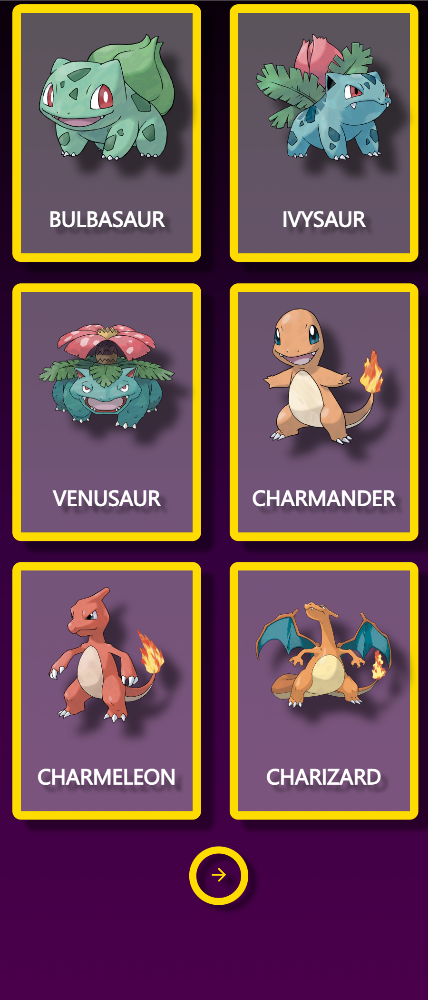
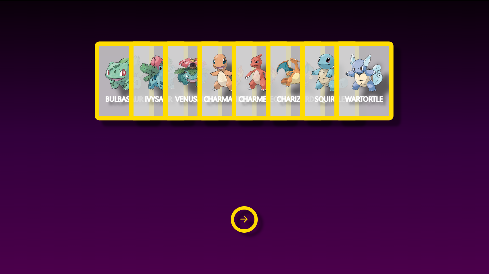

# 🎴 Pokédex Card Gallery

A responsive React.js application that displays Pokémon cards in dynamic layouts based on device orientation. Built with **React** and **pure CSS**, this lightweight project adapts to mobile and desktop without relying on CSS frameworks.

---

## 📱 Features

* **Responsive Layouts**

  * 🗭 **Portrait Mode**: Grid of 6 cards (3 rows × 2 columns)
  * 🔳 **Landscape Mode**: Overlapping stack of 8 cards, animated on hover

* **Pagination**

  * Buttons below the cards navigate between card sets
  * Consistent behavior across orientations

* **Pure CSS Animations**

  * Smooth scale-on-hover effects in landscape
  * Fully touch- and scroll-friendly on mobile
 
* **Fonts & Icons**  
  * Uses **Roboto** font for clean typography  
  * **Material UI Icons** for button and UI elements
 
* **Data Fetching**  
  * Retrieves real Pokémon data from [PokéAPI v2](https://pokeapi.co/) via **Axios**

---

## 🖥️ Demo

> 🔗 [**Live Preview**](https://alin-alexandru-ion.github.io/PokemonApp/)
> *(Deployed via Netlify, Vercel, or GitHub Pages — you can use any of them.)*

---

## 🛠 Tech Stack

* ⚡️ [React.js](https://reactjs.org/)
* 🎨 Pure CSS (no frameworks, no preprocessors)
* 🔤 [Roboto Font](https://fonts.google.com/specimen/Roboto)
* 🎯 [Material UI Icons](https://mui.com/components/icons/)
* 📦 [Axios](https://axios-http.com/)
* 📦 [PokéAPI v2](https://pokeapi.co/)

---

## 🔧 Installation

```bash
git clone https://github.com/your-username/pokemon-card-gallery.git
cd pokemon-card-gallery
npm install
npm run dev
```

> App runs locally at `http://localhost:3000/`

---

## 📂 Project Structure

```
/src
├── components/
│   ├── Pagination.jsx
│   └── PokemonCard.jsx
├── App.jsx
└── index.css
```

---

## 📸 Screenshots

| Portrait Mode                                    | Landscape Mode                                     |
| ------------------------------------------------ | -------------------------------------------------- |
|      |      |
|  |  |

---

## 📄 License

MIT © [Alin-Alexandru Ion](https://github.com/Alin-Alexandru-Ion)

---
